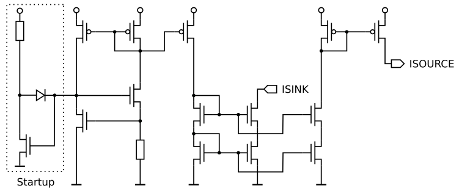

06.04.2025, 14:24:42

# Vth Current Reference

3 uA current reference with source- and sink-port.

 

[🔗 Schematics](vthref_sch.pdf) 

Show Tool Versions...

> xschem: 3.4.6 
> ngspice: 44.2 
> magic: 8.3.522 
> netgen: 1.5.293 
> ihpopenpdk: dev 

 

