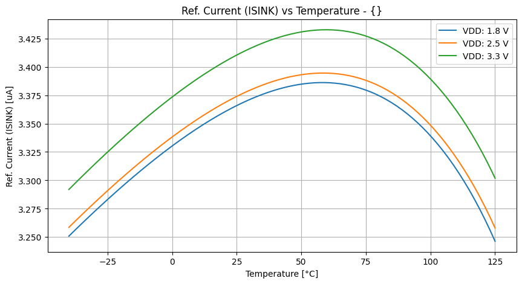
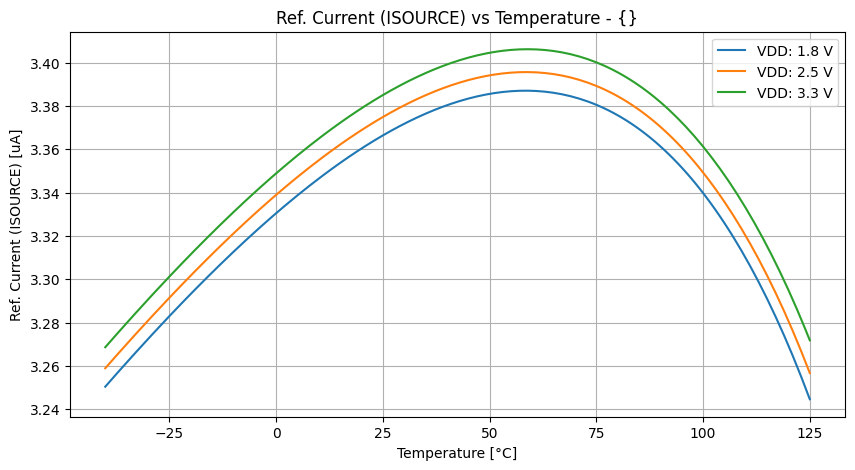
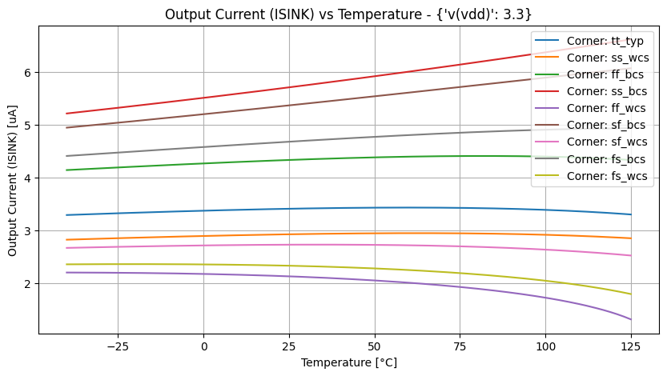
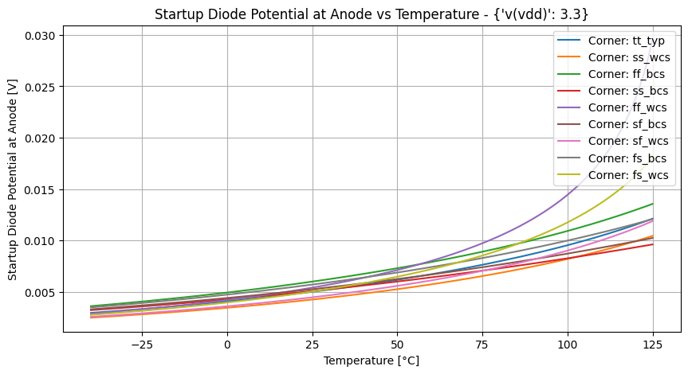
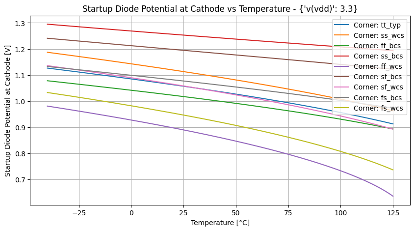
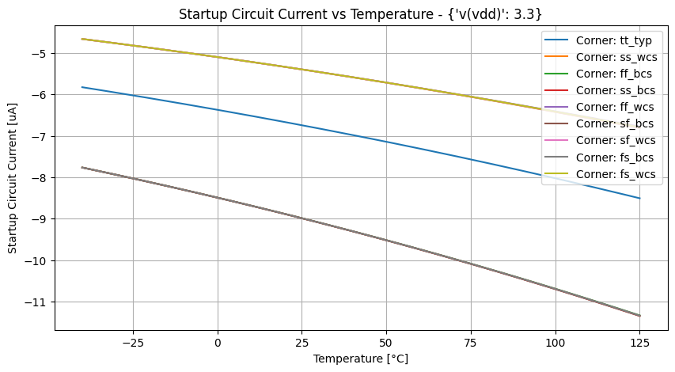
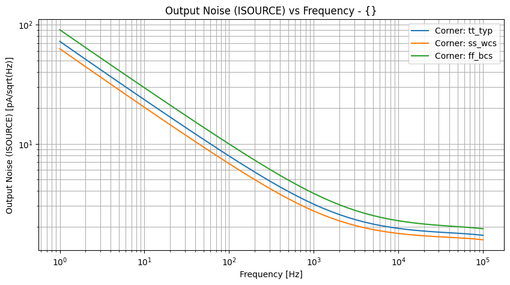
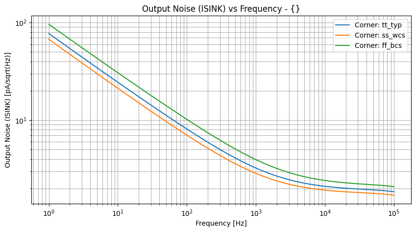

# DC Performance 

|  |
| :-- |
|  |
 

|  |
| :-- |
|  |
 

|  |
| :-- |
|  |
 

|  |
| :-- |
|  |
 

|  |
| :-- |
|  |
 

|  |
| :-- |
|  |
 

|  |
| :-- |
|  |
 

| __9065882294add75c79e9b94f79f54a31.png "") |
| :-- |
|  |
 

# DC Performance (Monte Carlo) 

| ,_('tt_typ_mismatch_mc',_-2)__02225623633d0f6307e0649078c055a4.png "vdd: 3.3 V tt_typ_stat_mc: (mos_tt_stat, res_typ_stat, cap_typ_stat) tt_typ_mismatch_mc: (mos_tt_mismatch, res_typ_mismatch, cap_typ_mismatch)") |
| :-- |
| vdd: 3.3 V tt_typ_stat_mc: (mos_tt_stat, res_typ_stat, cap_typ_stat) tt_typ_mismatch_mc: (mos_tt_mismatch, res_typ_mismatch, cap_typ_mismatch) |
 

| ,_('tt_typ_mismatch_mc',_-2)__02225623633d0f6307e0649078c055a4.png "vdd: 3.3 V tt_typ_stat_mc: (mos_tt_stat, res_typ_stat, cap_typ_stat) tt_typ_mismatch_mc: (mos_tt_mismatch, res_typ_mismatch, cap_typ_mismatch)") |
| :-- |
| vdd: 3.3 V tt_typ_stat_mc: (mos_tt_stat, res_typ_stat, cap_typ_stat) tt_typ_mismatch_mc: (mos_tt_mismatch, res_typ_mismatch, cap_typ_mismatch) |
 

# AC Noise 

|  |
| :-- |
|  |
 

|  |
| :-- |
|  |
 
